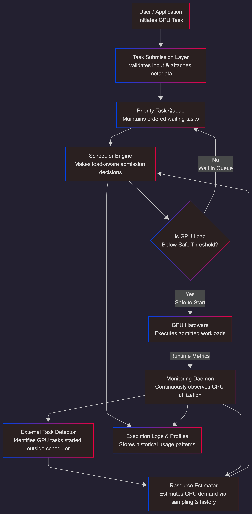
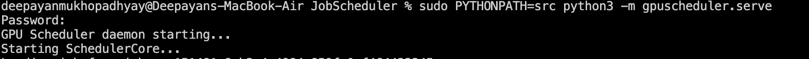
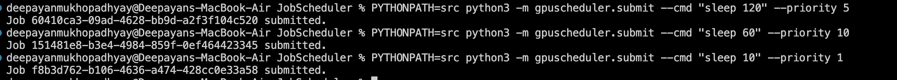
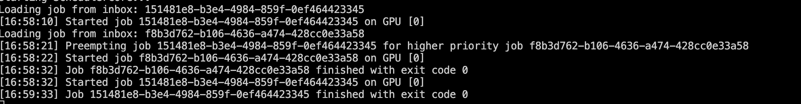
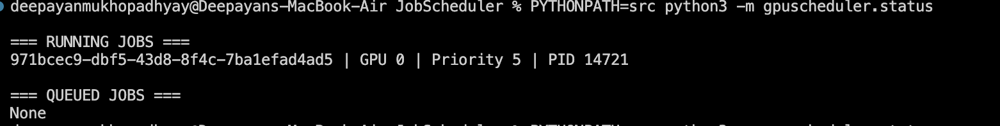
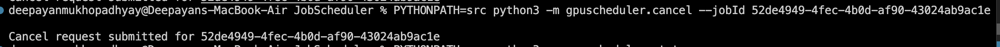

# 🚀 GPU Scheduler  
## A Smart Traffic Controller for Your GPU

> GPUs are powerful.  
> But when too many jobs run together, they become chaotic.  
> GPU Scheduler brings order.

---

# 📖 The Story (Explained Simply)

Imagine this.

You are training a deep learning model.  
It is using almost all your GPU.

Then you quickly open another script.  
Maybe a small experiment.  
Maybe a visualization tool.  
Maybe a quick inference test.

Suddenly:

- Training becomes slow  
- GPU memory errors appear  
- The system feels laggy  
- Your experiment crashes  

Your GPU is not weak.  
It is overloaded.

The problem is simple:

On most personal machines, nothing decides **when GPU jobs should start**.

Everything starts immediately.

And that creates chaos.

GPU Scheduler solves this.

---

# 🎯 What Is GPU Scheduler?

GPU Scheduler is a small background program.

It runs quietly and controls GPU jobs.

It decides:

- Which job runs first  
- Which job must wait  
- When a running job should stop  
- When a higher priority job should take over  

Think of it like a traffic signal for GPU tasks.

Without traffic signals, cars crash.

Without scheduling, GPU jobs interfere.

---

# 🧠 The Core Idea (In One Sentence)

Before starting any GPU job, the system asks:

"Is it safe to run this right now?"

If yes → it runs.  
If no → it waits.

If something more important arrives → it makes space.

---

# ⚙️ What The Current System Can Do

This version already supports:

- Priority-based scheduling  
- Background daemon (runs continuously)  
- Event-driven decision engine  
- Multi-GPU support (basic)  
- Preemption (stop low priority job for high priority job)  
- Resume stopped jobs  
- Cancel running jobs  
- Real-time job status  
- File-based CLI control  
- Job lifecycle state machine  

This is not a simple script.  
It is a real scheduling system.

---

# 🔄 How It Works (Step By Step)

Here is the full flow:

1. The scheduler daemon starts.
2. It begins monitoring GPU usage.
3. You submit a job.
4. The job enters a priority queue.
5. The scheduler checks:
   - Current GPU utilization
   - Memory safety
   - Job priority
6. If safe → job starts.
7. If not safe → job waits.
8. If a higher priority job arrives:
   - The running job may be stopped.
   - The higher priority job runs.
   - The previous job resumes later.

Everything happens automatically.

---

# 🏗 System Architecture

Below is a simplified architecture diagram.
  

---

# 🧩 Main Components Explained Simply

Daemon  
Runs forever in background.

Queue Manager  
Stores jobs and sorts them by priority.

Scheduler Core  
Makes decisions.

Monitor  
Checks GPU utilization.

Policy Engine  
Applies safety rules.

Runner  
Starts and stops processes using OS signals.

---

# 🔁 What Is Preemption?

Preemption means:

A less important job can be stopped so a more important job can run.

Example story:

You start training a model (low priority).  
Then your boss asks for urgent inference results (high priority).

GPU Scheduler will:

1. Stop the training job.
2. Run the urgent inference.
3. After it finishes, resume training.

No manual intervention needed.

---

# 🖥 Example Usage

Start the scheduler:

```bash
sudo PYTHONPATH=src python3 -m gpuscheduler.serve
```

Submit a job:

```bash
PYTHONPATH=src python3 -m gpuscheduler.submit --cmd "sleep 10" --priority 5
```

Check status:

```bash
PYTHONPATH=src python3 -m gpuscheduler.status
```

Cancel a job:

```bash
PYTHONPATH=src python3 -m gpuscheduler.cancel --jobId <job-id>
```

---

# 📸 Terminal Demo 

## Starting the Scheduler



---

## Submitting Jobs



---

## Preemption Example



---

## Checking Status



## Job Cancellation



---

# 🧠 Why This Is Important

Without scheduling:

- GPU memory conflicts happen  
- Jobs slow each other down  
- Experiments crash  
- Results become unstable  

With GPU Scheduler:

- Important jobs run first  
- GPU load stays controlled  
- Experiments become predictable  
- System remains stable  

---

# 🧪 Concepts Demonstrated

This project demonstrates:

- Operating system scheduling  
- Priority queues  
- Event-driven architecture  
- Multi-threaded programming  
- Process control using signals  
- Resource admission control  
- State machine design  
- GPU workload orchestration  

---

# 🛠 Future Improvements

Possible next steps:

- Memory-aware scheduling  
- Smarter preemption scoring  
- Fair scheduling across users  
- Persistent job storage  
- Live log streaming  
- Web dashboard  
- Multi-machine support  

---

# 💬 Final Thought

GPUs are extremely powerful.

But power without control leads to chaos.

GPU Scheduler adds control.

And that makes GPU workloads predictable, stable, and manageable.