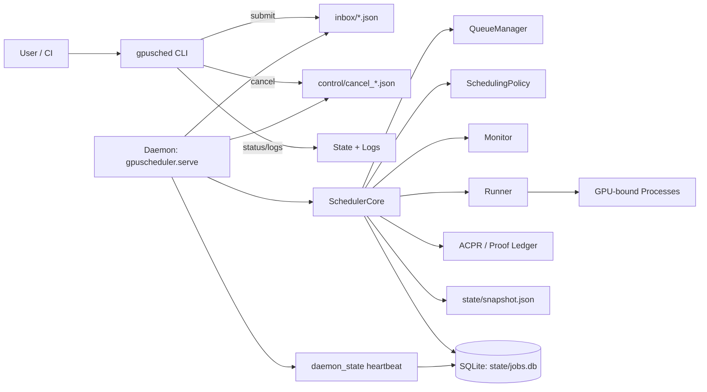

# GPU Scheduler v2
## A Story-Driven GPU Orchestrator

> GPUs are fast.  
> But fast without control becomes chaos.  
> GPU Scheduler v2 exists to bring control first.

---

## The Story

Imagine this.

You launch a long training run.  
Then someone asks for urgent inference.  
Then another script starts in the background.

Now your machine is not "busy".  
It is confused.

Jobs fight for memory.  
Priority is unclear.  
Work gets interrupted in the wrong order.

GPU Scheduler v2 is the layer that says:

"One moment. We will run this properly."

---

## What v2 Means Today

v2 is the first version that is genuinely usable end-to-end from CLI.

It is not a toy script anymore.

It has:

- A unified operational CLI (`gpusched`)
- Persistent state via SQLite
- Daemon lifecycle controls (`start`, `stop`, `status`)
- Recovery after daemon restarts
- Priority + memory-aware scheduling
- Multi-GPU launch support
- Smart preemption victim scoring
- Aging priority to reduce starvation
- Fair-share user caps
- Tunable placement strategies
- True pause/resume preemption path (`SIGSTOP`/`SIGCONT` with restart fallback)

---

## v2 Standpoint

Where v2 is strong:

- Excellent for single-node GPU orchestration
- Practical for research teams sharing limited GPUs
- Reliable for day-to-day scheduling workflows
- Good demonstration of systems design for production-minded interviews

Where v2 is intentionally still not "final SaaS":

- No web control plane yet
- No distributed multi-node scheduler yet
- No enterprise auth/RBAC layer yet
- Hardware attestation path is present but still evolving

Think of v2 as:

"Operational core is ready. Platform layer is next."

---

## Architecture Diagram (v2)


```mermaid
flowchart LR
    U[User / CI] --> C[gpusched CLI]
    C -->|submit| I[inbox/*.json]
    C -->|cancel| X[control/cancel_*.json]
    C -->|status/logs| S[State + Logs]

    D[Daemon: gpuscheduler.serve] --> I
    D --> X
    D --> K[SchedulerCore]

    K --> Q[QueueManager]
    K --> P[SchedulingPolicy]
    K --> M[Monitor]
    K --> R[Runner]
    K --> A[ACPR / Proof Ledger]

    R --> G[GPU-bound Processes]
    K --> N[state/snapshot.json]
    K --> DB[(SQLite: state/jobs.db)]
    D --> HB[daemon_state heartbeat]
    HB --> DB
```

Text view:

```text
gpusched CLI -> inbox/control -> daemon -> SchedulerCore
SchedulerCore -> QueueManager + Policy + Monitor + Runner + ACPR
SchedulerCore -> SQLite + snapshot.json
Runner -> GPU processes
```

---

## Main Components

- `gpuscheduler.cli`: unified user interface
- `gpuscheduler.serve`: daemon entrypoint and lifecycle
- `scheduler.core`: scheduling decisions, preemption, resume logic
- `scheduler.queueManager`: queue state, effective priority ordering
- `daemon.runner`: process launch/pause/resume/terminate
- `storage.sqliteStore`: persistent jobs + daemon metadata
- `security.*`: ACPR attestation/proof plumbing

---

## Unified CLI Quickstart

Use either:

- `./gpusched ...`
- `PYTHONPATH=src python3 -m gpuscheduler ...`

Start daemon:

```bash
./gpusched daemon start --gpus 0
```

Submit jobs:

```bash
./gpusched submit --cmd "sleep 20" --priority 10 --gpus 1 --mem 4000 --user alice
./gpusched submit --cmd "sleep 5" --priority 1 --gpus 1 --user bob
```

Check status:

```bash
./gpusched daemon status
./gpusched status
./gpusched status --all --json
```

Logs and cancel:

```bash
./gpusched logs --job-id <job-id> --follow
./gpusched cancel --job-id <job-id>
```

Stop daemon:

```bash
./gpusched daemon stop --force
```

---

## v2 Scheduling Knobs

Tune scheduler behavior directly from daemon start:

```bash
./gpusched daemon start \
  --gpus 0,1 \
  --aging-factor 0.002 \
  --max-concurrent-per-user 2 \
  --fair-share-priority-penalty 0.75 \
  --placement-mode fragmentation_aware
```

Placement mode options:

- `fragmentation_aware`
- `best_fit`
- `lowest_util`

---

## Current Limitations

These are known and explicit:

- Runtime limits are still enforced by polling loop, not kernel-level cgroup policing
- ACPR is functional at framework level, but still not hardened for full enterprise trust pipelines
- Single-node focus remains the design center in v2

---

## Why This Project Is Resume-Strong

It demonstrates:

- OS-level process control
- Scheduling algorithms and tradeoff design
- Fault recovery and persistence
- Practical CLI/daemon engineering
- Multi-GPU operational thinking
- Real-world "productionization" steps beyond algorithm demos

---

## Closing Note

v2 is the "serious core" version.

It takes GPU scheduling from idea to usable system.

v3 can build the platform around it.  
But v2 already does real work.
